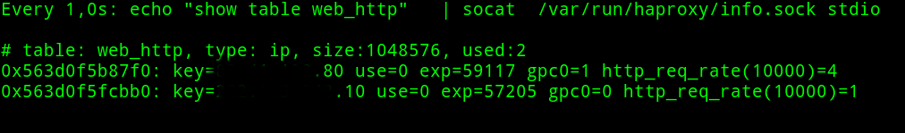

# haproxy-wp-bruteforce-proteccion
haproxy configuration in order to protect Wordpress from bruteforces attack with haproxy

It's posible configure haproxy that allow us to avoid Wordpress bruteforce attacks, one of the proposals is this old post of haproxy blog https://www.haproxy.com/blog/wordpress-cms-brute-force-protection-with-haproxy/, but for me in a haproxy version 1.5.18 in a Centos 7 doesn't work.

I have found that using other proposals from haproxy blog (https://www.haproxy.com/blog/use-a-load-balancer-as-a-first-row-of-defense-against-ddos/) and from (https://gist.github.com/jeremyj/e964a951634f1997daea) with some minor modifications it's posible to implement bruteforce protection from haproxy level to a Wordpress instalation:

In the frontend section you must to put:

    
        acl wp_login path_end -i /wp-login.php
        stick-table type ip size 1m expire 60s store gpc0,http_req_rate(10s)
        tcp-request content track-sc1 src if METH_POST wp_login
        tcp-request content reject if { src_get_gpc0 gt 0 }
        http-request deny if { src_get_gpc0 gt 0 }
        
In the backend section the confguration is:
        
        acl abuse src_http_req_rate(web_http) ge 5
        acl flag_abuser src_inc_gpc0(web_http) ge 0
        http-request deny if abuse flag_abuser

In this case I consider an abuser 5 login attemps in 10 second.

You can check the Ip source (key value) Wordpress authentication proccess and the abusers (gpc0 counter gt 0):

